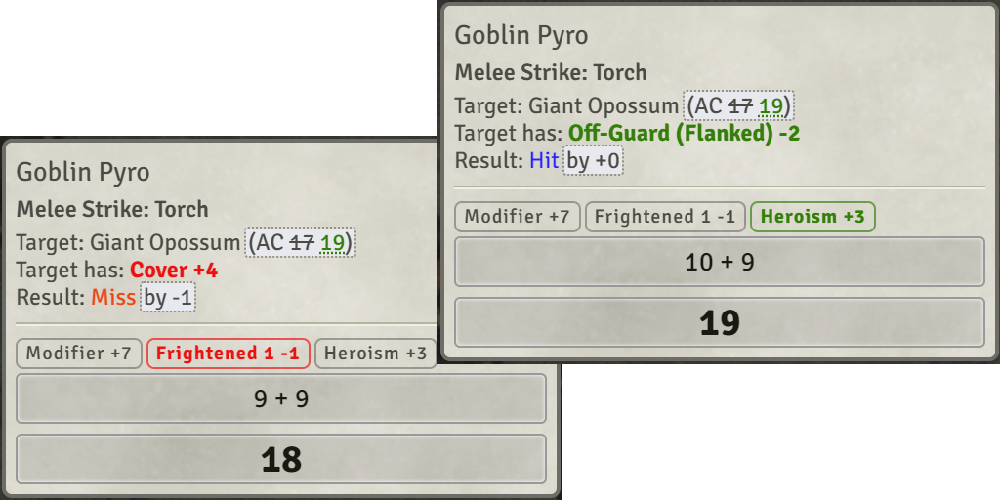
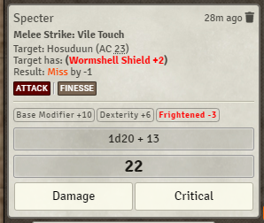
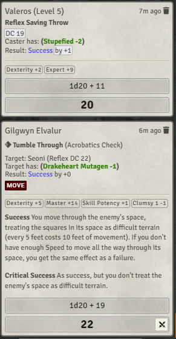

# [Pf2E Modifiers Matter](https://foundryvtt.com/packages/pf2e-modifiers-matter/)

### A module for the Pathfinder 2nd Edition system on Foundry Virtual Tabletop
#### (Starfinder 2e is also supported!)

Visibly highlight situations where temporary bonuses and penalties have changed the outcome of a roll.

With this module, the players/gamemaster can notice when one character helped support another, and point it out or
narrate it. For example, if the Fighter got a critical hit against a goblin only thanks to the Druid frightening the
goblin, or if the Fighter missed an attack due to a goblin's cover.

To install, browse for it in the module browser,
or [directly copy the manifest link for the latest release](https://github.com/shemetz/pf2e-modifiers-matter/releases/latest/download/module.json)
.

*Yes, technically this module is not about Modifiers but about all the other things that modify a roll, which happen to
not be called modifiers, despite applying modifications. But "Pathfinder 2nd Edition Highlight Status Effect Consequences" was too long.*

# Features

## Basic Behavior - Add color to active roller's bonuses/penalties in chat cards

By default in the Pathfinder 2e system, when you make an attack roll, saving throw, or other check against a DC, the
chat card that shows the result of your roll will usually contain a summary of your bonuses and penalties based on your
conditions. Additionally, the card shows you if you succeeded or failed (and for GMs, shows exactly by how much). (This 
behavior is controlled in the PF2E system settings, under Metagame Information -> Show results on attacks and saves)

This module **edits** the chat card to color these bonuses whenever they are relevant to a roll. In other words, when an
effect causes the outcome to change (by one or more degrees of success), the effect's bonus text on the card will be
colored green if it helped or orange/red if it hurt.

This will only apply color to temporary effects - it will ignore effects such as proficiency, ability modifier, runes,
or potency bonus. It will also ignore effects like Ooze Form (which fully replace your attack bonus), or the Ranger's
Flurry edge (which replaces the Multiple Attack Penalty).  It will also ignore "Skill Potency", "Spell Potency", etc,
which are common ABP-based modifiers that people add manually. You can add your own ignored effects in the settings!

The color will be a strong red/green for an effect that directly caused a change in outcome (and was necessary for the
change). A less striking color (yellow-green or orange) will be used for effects that were helpful/hurtful but not
strictly necessary. For example, if you rolled a total of 17 against an enemy with AC 16, you hit (Success +1). If
you've been currently under the effects of both Bless (+1 status bonus) and Assisting Shot (+1 circumstance bonus), then
either of them would have helped you land your attack, but no one of them was necessary for the attack, so they'll both
be "partially" highlighted. If an effect was definitely not necessary for the change in outcome - due to another effect
being the only one essential for the change - the unnecessary effect will not be colored at all.

### AC conditions

The module will also display similar status effect consequences when they apply to enemies' AC when making attacks
against them. This will add new text to the card (a setting exists to show or hide it from players). For example, it
will show up when an attack roll of 15 would normally miss the AC 16 goblin, except the goblin was off-guard and had
its AC reduced to 14.

(also note that this will treat missed attacks and critically missed attacks as usual, meaning sometimes you'll see that
a condition turned a miss into a critical miss even when you don't care about it. This is because some game mechanics
may interact with missed versus critically missed attacks - for example: Dueling Riposte, Confident Finisher.  You can change
this behavior in the settings, but it isn't per-character.)

### Spellcasting DC conditions, Class DC conditions

Spellcasting DC is fully supported - for example, if you successfuly save against a stupefied wizard's fireball, you'll
know that the stupefied condition mattered.

Class DC is *mostly* supported.  It should work when the embedded save button appears directly inside the posted item's
chat message; for example, if your kineticist is Drained and is using Hail of Splinters, the module will highlight a
success that happened only due to that debuff.

However, class DC (and other DCs) are **not supported if they appear in a Note**;  that is, if the check button they
create is in text that is appended to an attack, damage, or similar chat message.  For example, the Monk's Stunning Fist
won't properly have highlights with this module.  (This issue is a PF2E system problem:  See https://github.com/foundryvtt/pf2e/issues/9824)

### Highlight potential for Amped Guidance or Nudge Fate

If you have the Psychic's [Guidance Amp](https://2e.aonprd.com/ConsciousMinds.aspx?ID=2), or the witch's 
[Nudge Fate](https://2e.aonprd.com/Spells.aspx?ID=1890), you can enable this setting to highlight rolls that fail by 1
(or by 2 if you can heighten Amped Guidance), where you could use your ability to change the outcome.

## Examples

Example situation:

Ezren is attacking the skeleton with a stick. They both have a lot of effects on their actors.

Here you can see that the attack ended up as a critical hit (because total >= DC + 10). The off-guard condition (previously
named the "Flat-Footed" condition) that
was applied to the skeleton has been crucial to get this outcome; the other three buffs (frightened skeleton, assisting
shot, bless)
were useful but only two of were needed (any two).

Same as above, but all conditions were necessary to get the crit.

A miss caused by Ezren's Enfeebled condition.

Note that Ezren was also Frightened, but due to Pathfinder 2e rules, since both of them apply "status"-type penalties one
of them is ignored by the system (in this case Frightened), and isn't shown on the chat card.

Fun example of a special case:  the positive conditions together are responsible for an outcome, and the negative
conditions together are responsible for an outcome, but also no one/single condition here was necessary to reach this
result. In a way, all of these status effects were equally important here.

In this example, the attack failed because the skeleton had greater cover (+4 to AC). Even though Ezren is also
Enfeebled the Enfeebled condition modifier on this card will not be highlighted because it did not affect the outcome
whatsoever.

## Did the UI change?

The PF2e UI is changing often (which is a good thing!), as do some terms like "Flat-Footed", and that means the screenshots above are incorrect.

Here's what the UI looks like, as of v1.4.5:

And as of v1.7.0 (added visible modifiers for caster DC and target actor DC:

## API & Integration with other modules

There is a hook, `'modifiersMatter'`, which you can listen to, if you want things to trigger based on modifiers mattering.
For example, the code includes a sample function - `exampleHookInspireCourage` - which will make Foundry play a short
chime sound each time Inspire Courage causes a success.  The extra `significance` parameter will let you know
whether the modifier was necessary or useful - one of ESSENTIAL, HELPFUL, HURTFUL, or DETRIMENTAL.

This hook is already in use by the PF2e Animations module.  [Here's a link to a demo video (discord message)](https://discord.com/channels/880968862240239708/1006806454700875816/1089257601629442080).  To
add new animations for MM integration, you can either add an entry to play whenever the modifier matters, or narrow it
down depending on significance.  For example, if you want your animation to play whenever off-guard (or flanking) is
relevant, name the entry "Modifiers Matter: Off-Guard".  If you want it to only play when off-guard was crucial to
improving the effect, name it "Modifiers Matter: Off-Guard (ESSENTIAL)".

See [Pf2e Rules Lawyer](https://github.com/ChasarooniZ/Pf2e-Rules-Lawyer) for a module that uses this for its core
functionality: displaying a banner whenever a roll included an important modifier.

## Accessibility

Feel free to contact me if you want different colors instead of red and green, telling me which colors work best for
you, and I'll add a setting to the module.

## Discussion

You can discuss this module in its [dedicated thread in the Pathfinder on Foundry discord server](https://discord.com/channels/880968862240239708/1384806610635063296), or open a github issue here if it's a bug or a feature request.
